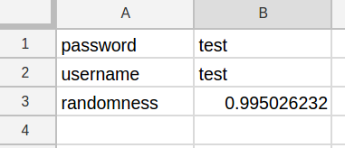

# sheet-storage

**sheet-storage** is a key-value store with more-or-less the same API as localStorage but stores data in a Google Sheet instead.

It's not efficient (no batching) but it's only meant as a quick proof of concept.

## Usage

```bash
npm install
```

[Create an app](https://console.developers.google.com/apis/credentials) and download your `client_secret.json` file. Provide the path to this file in the `TOKEN_PATH` environment variable.

Provide the path for the cached credentials in the `CACHE_PATH` environment variable.

```js
const SheetStorage = await require("./storage.js")

// Create a new instance of a sheet, passing the sheet ID.
const sheetStorage = new SheetStorage('XXX')

// Read/write values with get/set.
var username = await sheetStorage.get('username')
var password = await sheetStorage.get('password')

sheetStorage.set('randomness', Math.random())
```

Column A stores keys, column B stores values.



## Contributions

Open an [issue](https://github.com/crdx/sheet-storage/issues) or send a [pull request](https://github.com/crdx/sheet-storage/pulls).

## Licence

[MIT](LICENCE.md).
